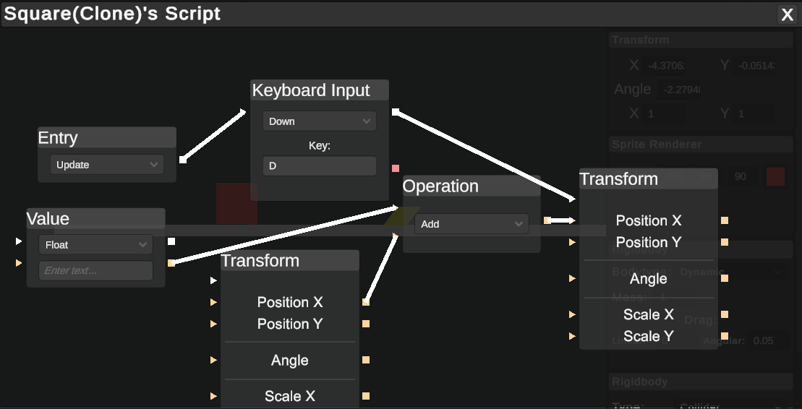
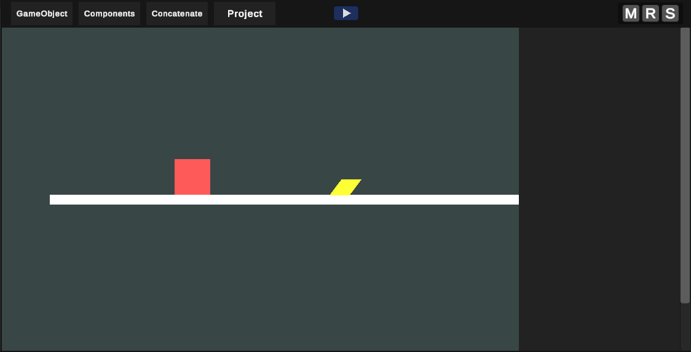
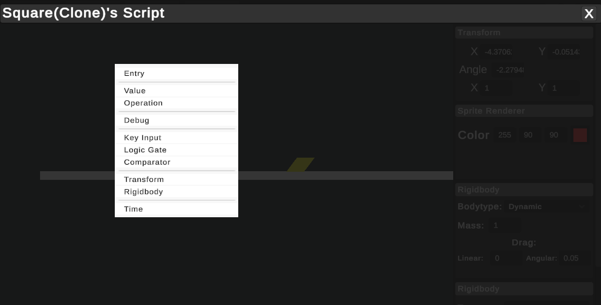
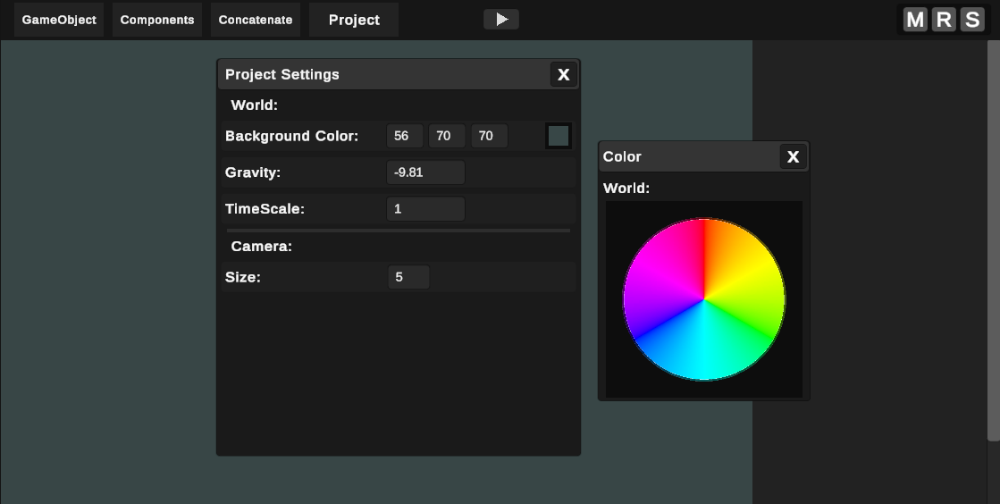

# ANI Engine 🎮

🚀 [See This Project on my Website](https://www.anindustries.pl/projects/ANIEngine)

## Introduction 🌟

ANI Engine is a unique game development platform, a creative twist on Unity by being a Unity clone developed within Unity itself. 

## Key Features 🔑

- **Object Modification**: Customize objects with simple adjustments to rotation, scale, color, and position.
- **Innovative Scripting**: Create advanced behaviors easily with a node-based scripting system.
- **User-Friendly**: An intuitive interface that caters to both novices and pros.
- **Expandable**: Designed for further enhancements and community-driven plugins.

## Tech used 🛠️

  

## Screenshots 🖼️

<table align="center">
  <tr>
    <td>
      
      
Scripting system

    </td>
    <td>
      
      
Working physics

    </td>
  </tr>
  <tr>
    <td>
      
      
Variety of different nodes

    </td>
    <td>
      
      
Customization

    </td>
  </tr>
</table>

## Author 💚
[Artur Niemiec](https://anindustries.tech/) - ([@MrNtex](https://www.github.com/MrNtex))
